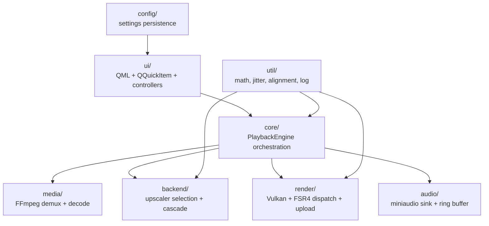

# Architecture

Temporal Forge Player is a GPU-native video player that applies FSR-style
temporal upscaling to local video files **without** frame interpolation, frame
generation, or cadence conversion.

```text
1 decoded input frame → 1 upscaled displayed output frame
same timestamps · same frame count · same source frame rate
```

This document is the source of truth for the layered structure, the threading
model, and the backend cascade. Read it before moving code across files or
touching the playback/FSR4 lifecycle.

## Layer diagram



### `media/` — FFmpeg pipeline

- `Demuxer` — opens a URL, reads packets, exposes stream info + seeking.
- `VideoDecoder` — decodes video packets (VAAPI when available, CPU fallback).
  Produces `DecodedVideoFrame` with YUV planes + motion vectors.
- `AudioDecoder` — decodes audio packets to interleaved float samples.

### `core/` — orchestration

- `PlaybackEngine` (QObject, exposed to QML as `playback`) owns the demux,
  decode, and audio threads plus the FSR4 dispatch path. This is the load-bearing
  class; see **Threading model** below.

### `backend/` — upscaler cascade

A single interface (`ITemporalUpscalerBackend`) with multiple implementations
selected by `BackendSelector`. On failure the selector cascades down so
playback never silently breaks:

```text
1. FSR4-RE INT8 experimental   (proof-gated default selection on supported RDNA3)
        ↓ fails / assets absent
2. FSR 3.1.5 (SDK)             (UNAVAILABLE in this tree: TFORGE_HAVE_FSR3_SDK
                                is never defined by any build file, so
                                sdkAvailable() is always false — this tier is
                                a compiled-out stub in every build)
        ↓ SDK not linked / fails
3. Spatial fallback             (compute-shader EASU/RCAS, always available
                                 once Vulkan initializes)
```

The default backend is `BackendKind::Fsr4ReExperimental` with
`allowExperimentalAsDefault = true` (`src/config/SettingsStore.hpp`).

FSR4 native INT8 packs and generic weight blobs are not redistributable
in-tree. Provisioning is documented in `resources/fsr4/native_i8/README.md`
and `tools/build_native_int8_pack.sh`. When the assets are absent, the
engine falls back down the chain and logs the gap.

User-facing backend labels are centralized: `backendDisplayName()` in
`src/backend/UpscaleTypes.cpp` and `BackendSelector::activeLabel()`. The SDK
tier is shown as `FSR 3.1.5 (SDK)` in both (the enum remains
`BackendKind::Fsr23Sdk` as an internal name).

### `render/` — Vulkan

The runtime requires **Vulkan 1.3**: the instance is created with
`app.apiVersion = VK_API_VERSION_1_3` (`VulkanContext.cpp`), and the Qt
Vulkan instance is requested at 1.3 as well. A Vulkan 1.2-only machine
cannot run the player — this is a hard requirement, not a capability
negotiation.

- `VulkanContext` — instance/device/queue/command-pool lifecycle. Shares the
  Vulkan instance with Qt so presentation and compute use the same device.
- **Queue policy (target-specific):** the universal graphics/compute queue is
  used for FSR because a measurement on ONE GPU (RX 7900 GRE) showed the
  generated graph is measurably faster there than on RADV's dedicated compute
  family (`main.cpp`). The dedicated compute queue is discovered but currently
  unused. This policy is preserved for performance and should be re-measured
  before being assumed portable to other GPUs.
- `GpuImageUploader` — uploads decoded frames to GPU images (DRM-prime import
  when available, CPU staging fallback), manages staging buffers + readback.
- `Fsr4DispatchHarness` — creates the FSR4 compute pipelines + descriptor sets
  and runs the per-frame INT8/FP16 dispatch (the 14-pass U-Net CNN).
- `SideBufferSynth` — synthesizes reactive/depth masks for the FSR side inputs.

### `audio/` — master clock

- `RingBuffer` (`AudioRing`) — single-producer/single-consumer lock-free ring.
- `AudioSink` — miniaudio-backed output. **The audio device callback is the
  master clock** (spec 01). Never slow audio to wait for video.

### `ui/` — QML surface

- `VideoSurfaceItem` — native Vulkan `QQuickItem` that samples the completed
  FSR4 output image directly on the Qt render thread.
- Controllers (`FsrController`, `VideoSettingsController`, `CompareController`,
  `PostProcessController`, `ScreenCaptureController`, `DebugOverlayModel`) are
  QML bridges bound from `main.cpp` as context properties.

## Threading model (spec 01)

There are four threads that interact. Getting this wrong has caused two
recorded regressions (see repo notes). **Do not change these invariants
without a test that proves the new behavior.**

| Thread | Owner | Role |
|---|---|---|
| Main / UI | Qt | window events, controls, settings, QML |
| Playback / decode | `PlaybackEngine` | demux scheduling, video+audio decode, FSR4 dispatch |
| Audio device (realtime) | miniaudio | the master clock — reads the ring buffer |
| Qt render | Qt scene graph | samples the FSR4 output image for display (~60Hz) |

### Load-bearing invariants

1. **`fsrDispatchMutex_` serializes UI-thread teardown vs decode-thread dispatch
   ONLY.** The render-thread accessors (`fsr4NativeOutput()` / `fsr4RawOutput()`)
   must **never** take this mutex. Locking them serialized every 60Hz render
   frame against every 5ms FSR4 dispatch and caused visible stutter.
2. **Teardown safety for the render thread comes from `vkQueueWaitIdle()`** in
   `teardownFsr4Path()`, which retires in-flight GPU work before the uploader is
   freed. The narrow CPU pointer-read race (TOCTOU on `fsr4Uploader_`) is
   pre-existing and acceptable — it only happens on user-initiated teardown.
3. **`setFsrViewport()` only flips `fsr4Ready_` when the preset *scale* changes**,
   not on pure window resize. Resizing the window changes presentation only; it
   must never recreate the FSR4 context (that forces a multi-second weight-blob
   reload).
4. **The decode thread does synchronous `vkWaitForFences(UINT64_MAX)`** per frame
   inside `Fsr4DispatchHarness::dispatchFrame`. Anything that wants to stop the
   decode thread cleanly must let the current dispatch finish (or guard it with
   the abort flag `fsrAbortRequested_`).

### QML enum gotcha

An enum on a C++ class exposed via `setContextProperty` (an *instance*, not a
type) cannot be referenced as `TypeName.EnumValue` from QML — use raw integer
literals. Enums on classes registered via
`qmlRegisterType<Type>("URI", 1, 0, "QmlName")` **are** accessible as
`QmlName.EnumValue`.

## FSR target model (spec 02)

```text
source frame
  → FSR preset reconstruction target   (source × preset ratio)
  → final presentation scale to window
```

The FSR target depends only on source size and preset — **never** on window
size. Resizing the window changes only the presentation scale and never
recreates the FSR context or resets history.

| Preset | Ratio |
|---|---:|
| NativeAA | 1.0x |
| Quality | 1.5x |
| Balanced | 1.7x |
| Performance | 2.0x |
| Ultra Performance | 3.0x |

## Build

Requirements (Linux): C++23 compiler; CMake ≥ 3.24 **and Ninja** (ninja is a
hard configure requirement); Qt 6.6+ (Core/Gui/Quick/Qml/Widgets/
**ShaderTools**); glslangValidator (required by `cmake/ShaderCompile.cmake`);
Vulkan loader + headers, API 1.3; FFmpeg dev libraries; python3 for tooling.
Vendored/bundled: miniaudio single header (`external/`), Vulkan headers shim
(`external/vulkan_include/`). See the README `Requirements` table for the
full dependency matrix including optional test/research dependencies.

```sh
cmake -S . -B build -G Ninja -DCMAKE_BUILD_TYPE=Release
cmake --build build
ctest --test-dir build --output-on-failure
./build/temporal_forge_player
```

Set `TFORGE_VK_VALIDATE=1` to enable the Vulkan validation layer.

## Diagnostics limitations

- `GpuCapabilityProbe` identifies RDNA3/RDNA4 by **marketing-name substring
  matching** on the device name (e.g. "7900", "RX 7", "NAVI3", "9070"). This
  is a known diagnostic-tooling limitation: unusual or localized device names
  can be misclassified, which affects backend eligibility reporting, not
  correctness of the fallback chain.

## Environment contract

Production code reads a large set of `TFORGE_*` environment variables
(experiment knobs for jitter, DRS, chain passes, dumps, cache dirs,
validation, and more). They are experimental, default-off/neutral, and
runtime-configurable by design — testing another strength/filter/value must
not require a recompile. The authoritative inventory is
`grep -rn "getenv" src/`. See
[`environment.md`](environment.md) for the contract.

The settings file location prefers `$XDG_CONFIG_HOME` / `$HOME/.config`
(`temporal-forge-player/settings.json`) and falls back to a CWD-relative file
(`temporal-forge-player-settings.json`) only when neither environment
variable is set (`SettingsStore::defaultPath`).

## Where to look

- Lifecycle orchestration: `src/core/PlaybackEngine.cpp`
- FSR4 dispatch (the 14-pass CNN): `src/render/Fsr4DispatchHarness.cpp`
- Backend cascade: `src/backend/BackendSelector.cpp`
- Frame upload / DRM import: `src/render/GpuImageUploader.cpp`
- Audio clock: `src/audio/AudioSink.cpp`, `src/audio/RingBuffer.hpp`
- QML wiring: `src/main.cpp`, `resources/qml/`

For the reverse-engineering background on the FSR4 neural network, see
`docs/reports/FSR4_RECONSTRUCTION_STATUS_20260709.md`.
